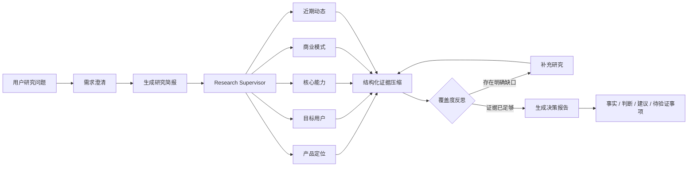

# CompeteX · AI 竞品情报研究 Agent

> 把一次分散、难复核的竞品调研，转化为有状态、可追踪、带来源的产品决策材料。

[](https://compete-x-lang-graph.vercel.app/)
[](https://www.python.org/)
[](https://github.com/langchain-ai/langgraph)
[](LICENSE)

**在线体验：** [https://compete-x-lang-graph.vercel.app/](https://compete-x-lang-graph.vercel.app/)

CompeteX 是基于 LangChain 官方 [Open Deep Research](https://github.com/langchain-ai/open_deep_research) 二次设计的中文竞品研究产品原型。它围绕 AI 产品经理、战略分析师和创业团队的工作场景，将需求澄清、研究规划、五维并行检索、证据压缩、覆盖度反思和报告生成组织成一条 LangGraph 工作流。

它不是替用户做决策的聊天机器人。它的目标是更快形成一份**有来源、可复核、明确区分事实与判断**的研究底稿。

## 为什么做 CompeteX

传统竞品研究通常存在几个问题：

- 信息分散在官网、文档、定价页、更新日志、新闻和社区中；
- 不同竞品的研究口径不一致，横向比较容易漏项；
- 搜索结果、分析判断和产品建议混在一起，难以复核；
- 调研过程不可追踪，重复搜索多，时间与模型成本难控制；
- 最终报告看似完整，却没有说明证据缺口和待验证事项。

CompeteX 用固定研究框架和多 Agent 协作解决这些问题。

## 核心能力

- **五维并行研究**：首轮固定从产品定位、目标用户、核心能力、商业模式、近期动态五个维度同时展开。
- **统一横向口径**：每个 Researcher 在同一维度内比较全部研究对象，而不是简单地“一家竞品一个 Agent”。
- **结构化证据**：研究结果保留来源标题、URL、发布日期、证据内容、置信度与证据缺口。
- **覆盖度反思**：Supervisor 汇总首轮结果，只对明确缺失的信息发起补充研究。
- **决策型报告**：最终输出区分已验证事实、分析判断、产品建议和待验证事项。
- **中文 Web 搜索**：默认使用免 Key 的中文网页搜索，并针对公共搜索源限制并发，减少验证码和限流。
- **BYOK 多模型支持**：用户可选择 DeepSeek、OpenAI、Anthropic 或 Google Gemini，并使用自己的 API Key。
- **流式进度反馈**：前端实时展示需求澄清、研究简报、并行研究和报告生成等节点状态。
- **成本边界**：在线版限制研究轮数、并发研究单元和单 Researcher 工具调用次数。

## 工作流程



### 五个标准研究维度

1. **产品定位**：核心问题、价值主张、使用场景、市场类别与差异化表述。
2. **目标用户**：核心用户群、典型角色、关键需求、使用门槛与市场信号。
3. **核心能力**：功能、工作流、技术能力、集成生态与能力边界。
4. **商业模式**：定价、套餐、付费对象、销售方式与商业化路径。
5. **近期动态**：最近十二个月的重要发布、合作、融资、监管和市场信号。

## 报告标准

竞品与产品战略类任务默认生成以下结构：

1. 执行摘要
2. 产品定位
3. 目标用户
4. 核心能力
5. 商业模式
6. 近期动态
7. 横向对比与产品建议
8. 待验证事项
9. 来源

重要结论会尽量标注高、中、低证据置信度。信息不足时，报告会明确写出“公开证据不足”，而不是用推断补齐事实。

## 在线使用

打开 [CompeteX 中文研究台](https://compete-x-lang-graph.vercel.app/)，点击右上角的“配置 Key”：

1. 选择模型服务商；
2. 填写对应的模型 API Key；
3. 选择网页搜索方式；
4. 按需调整研究模型和报告模型；
5. 输入研究问题并开始研究。

当前前端提供以下默认组合：

- **DeepSeek**：`deepseek:deepseek-chat`
- **OpenAI**：研究使用 `openai:gpt-4.1-mini`，报告使用 `openai:gpt-4.1`
- **Anthropic**：`anthropic:claude-sonnet-4-5`
- **Google Gemini**：研究使用 `google_genai:gemini-2.5-flash`，报告使用 `google_genai:gemini-2.5-pro`

所选模型需要支持工具调用；研究流程中的部分节点还依赖结构化输出能力。

### 搜索方式

- **中文 Web 搜索**：默认选项，免费且无需 Key；移动 360 为主通道，Google 中文新闻为降级通道。
- **Tavily**：需要额外填写 `TAVILY_API_KEY`。
- **不使用搜索**：适合调试对话流程，不建议用于真实竞品研究。

## BYOK 与密钥边界

在线版采用 BYOK（Bring Your Own Key）模式：

- API Key 只保存在当前页面的内存变量中；
- 刷新页面或点击“清除”后，前端不再保留 Key；
- Key 不会写入本仓库，也不需要保存到 Vercel 环境变量；
- 发起研究时，Key 会随 HTTPS 请求发送到本项目的 Vercel Function，再用于调用所选模型服务商；
- 应用代码不会持久化 Key，流式错误信息也会对请求中的 Key 做脱敏处理。

请勿在研究问题、截图、Issue 或日志中粘贴真实密钥。生产化使用前，还应根据组织要求补充鉴权、审计、速率限制和密钥托管方案。

## 本地运行

### 环境要求

- Python 3.10 或更高版本
- [uv](https://docs.astral.sh/uv/)
- 至少一个模型服务商的 API Key（通过页面或 `.env` 提供）

### 1. 克隆并安装

```bash
git clone https://github.com/xiaoyinxy/CompeteX-LangGraph.git
cd CompeteX-LangGraph
uv sync
```

### 2. 选择密钥配置方式

如果使用完整 Web 应用，可以跳过 `.env`，启动后直接在页面的“配置 Key”窗口中填写密钥。

如果使用 LangGraph Studio，先创建 `.env`：

PowerShell：

```powershell
Copy-Item .env.example .env
```

Bash：

```bash
cp .env.example .env
```

在 `.env` 中填写需要使用的密钥。Studio 的默认模型配置使用 DeepSeek：

```env
DEEPSEEK_API_KEY=your_deepseek_api_key

# 可选：LangSmith 链路追踪
LANGSMITH_API_KEY=
LANGSMITH_PROJECT=CompeteX
LANGSMITH_TRACING=false
```

`.env` 已被 `.gitignore` 忽略，请勿提交真实密钥。

### 3. 启动完整 Web 应用

```bash
uv run --with uvicorn uvicorn app:app --reload --host 127.0.0.1 --port 3000
```

打开：

- 中文研究台：<http://127.0.0.1:3000/>
- 健康检查：<http://127.0.0.1:3000/api/health>

本地 Web 应用同样使用页面内 BYOK 配置；无需把浏览器中使用的 Key 写入 `.env`。

## LangGraph Studio

如需观察每个节点的输入、输出、耗时和调用轨迹，可安装完整开发依赖并启动 LangGraph Studio：

```bash
uv sync --extra full
uv run langgraph dev --allow-blocking --no-reload
```

随后访问：

- Studio：<https://smith.langchain.com/studio/?baseUrl=http://127.0.0.1:2024>
- API 文档：<http://127.0.0.1:2024/docs>
- 健康检查：<http://127.0.0.1:2024/ok>

Windows 用户也可以运行：

```powershell
.\scripts\start_demo.ps1
```

## Vercel 部署

仓库已经包含 Vercel 所需配置：

- `app.py`：FastAPI 入口、流式研究 API 与静态前端托管；
- `vercel.json`：Python Function 时长与部署排除项；
- `pyproject.toml`：运行依赖和 `app:app` 入口声明；
- `web/`：无需构建步骤的前端资源。

部署步骤：

1. 在 Vercel 中导入本 GitHub 仓库；
2. 保持默认构建设置；
3. 部署完成后打开生产域名；
4. 在页面中填写自己的模型 Key。

BYOK 模式下无需在 Vercel 保存模型 Key。当前 Function 最长运行时间配置为 300 秒；研究范围过大时，应减少竞品数量或缩小研究问题。

## HTTP API

### 健康检查

```http
GET /api/health
```

响应：

```json
{
  "status": "ok",
  "service": "competex"
}
```

### 发起研究

```http
POST /api/research
Content-Type: application/json
```

请求示例：

```json
{
  "messages": [
    {
      "role": "user",
      "content": "对比 Cursor、GitHub Copilot 和 Windsurf，并给出中国开发者工具团队的切入机会。"
    }
  ],
  "keys": {
    "deepseek": "your_api_key"
  },
  "search_api": "bing",
  "research_model": "deepseek:deepseek-chat",
  "final_report_model": "deepseek:deepseek-chat",
  "allow_clarification": true
}
```

接口以 `application/x-ndjson` 流式返回事件。事件类型包括：

- `started`：研究任务已开始；
- `progress`：某个 LangGraph 节点已完成；
- `message`：澄清问题或中间消息；
- `result`：最终报告内容；
- `complete`：本轮流程结束，状态可能是 `complete` 或 `awaiting_input`；
- `error`：运行错误，响应会尝试脱敏请求中的 API Key。

## 项目结构

```text
CompeteX-LangGraph/
├─ app.py                         # FastAPI / Vercel 入口
├─ web/                           # 中文研究台前端
│  ├─ index.html
│  ├─ app.js
│  ├─ styles.css
│  └─ config.css
├─ src/open_deep_research/
│  ├─ deep_researcher.py          # LangGraph 主图、Supervisor 与 Researcher
│  ├─ prompts.py                  # 中文研究与报告规范
│  ├─ configuration.py            # 模型、搜索、并发与预算配置
│  ├─ state.py                    # Agent State 与结构化结果 Schema
│  └─ utils.py                    # 搜索、模型、MCP 与通用工具
├─ tests/
│  ├─ test_competex_research_contract.py
│  └─ test_vercel_app.py
├─ docs/PRODUCT_DESIGN_CN.md      # 产品设计与评测方案
├─ demo/DEMO_QUESTIONS_CN.md      # 演示题库
├─ langgraph.json                 # LangGraph 图配置
├─ vercel.json                    # Vercel Function 配置
└─ pyproject.toml                 # Python 项目与依赖配置
```

## 测试与质量检查

安装开发依赖：

```bash
uv sync --extra dev
```

运行回归测试：

```bash
uv run pytest
```

检查当前 Vercel 入口与 CompeteX 回归测试：

```bash
uv run ruff check app.py tests/test_vercel_app.py tests/test_competex_research_contract.py
```

当前回归测试覆盖：

- 五个标准研究维度是否完整；
- 五个 Researcher 是否同批并行执行；
- 单个研究单元失败时是否保留其他结果；
- 结构化证据与证据缺口格式；
- 中文搜索结果和直接来源链接解析；
- Vercel 健康检查、静态页面和请求级 BYOK 配置。

## 推荐体验问题

```text
请为计划进入中国市场的 AI 会议助手团队，对比 Otter.ai、Fireflies.ai 和
Notion AI Meeting Notes。研究范围限定为截至今天可公开验证的信息，重点覆盖
目标用户、核心工作流、定价、集成生态、差异化、近期产品动态和用户采用阻力。
优先引用官网、定价页、帮助文档和更新日志。区分事实、推断与建议；信息不足时
明确说明。最后给出一个面向 20—200 人中国科技公司的 MVP 机会清单，并按价值、
可行性和风险排序。
```

更多题目见 [demo/DEMO_QUESTIONS_CN.md](demo/DEMO_QUESTIONS_CN.md)。

## 已知边界

- 搜索结果受网页可访问性、搜索源质量和时效性影响；
- 引用存在不代表结论一定正确，关键结论仍需人工复核；
- 公共中文搜索可能遇到限流、验证码或页面结构变化；
- 不同模型对工具调用和结构化输出的兼容性不同；
- Vercel Serverless Function 不适合无限时长或超大规模研究；
- 当前项目是个人产品原型，不包含企业级租户隔离、权限系统和完整审计能力。

## 来源、改造范围与致谢

CompeteX 基于 LangChain 官方 [Open Deep Research](https://github.com/langchain-ai/open_deep_research) 开发，保留其 LangGraph 深度研究架构，并针对中文竞品研究场景完成了以下产品化改造：

- 固定的五维并行竞品研究流程；
- 中文搜索策略和一手来源优先级；
- 结构化证据、置信度与证据缺口；
- 面向产品决策的中文报告格式；
- DeepSeek 兼容处理和成本边界；
- 中文 Web UI、BYOK 配置和流式进度展示；
- FastAPI API 与 Vercel 部署；
- 面向关键研究契约的自动化测试。

这是对开源研究框架的垂直场景产品化实践，不应将上游项目的基准成绩表述为本项目独立取得的成绩。

## 相关文档

- [产品设计与评测方案](docs/PRODUCT_DESIGN_CN.md)
- [演示题库](demo/DEMO_QUESTIONS_CN.md)
- [项目故事线](INTERVIEW_STORY_CN.md)
- [改造思路说明](产品改造.md)

## License

本项目沿用上游项目的 [MIT License](LICENSE)。
